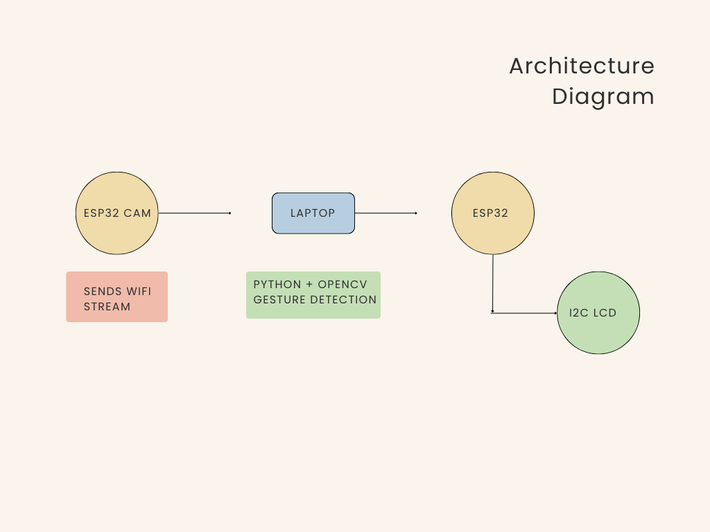

 ESP32-CAM Gesture Recognition
 
 OVERVIEW
 --------
This project implements a real-time hand gesture recognition system using an ESP32-CAM, Python, and OpenCV.

The ESP32-CAM streams live video over Wi-Fi to a Python application running on a computer. The application detects hand gestures and sends the recognized gesture wirelessly to an ESP32, which displays the result on an I2C LCD.

---

> FEATURES
----------

- Real-time camera streaming
- Gesture recognition using OpenCV
- Wireless communication
- LCD output
- Modular architecture

> HARDWARE
----------

- ESP32-CAM
- ESP32 DevKit
- 16x2 I2C LCD
- Wi-Fi Router

> SOFTWARE
-----------

- Python
- OpenCV
- cvzone
- Arduino IDE


> SYSTEM ARCHITECTURE



---

> WORKFLOW
-----------

1. ESP32-CAM captures video.
2. Video is streamed to Python.
3. OpenCV detects hand gestures.
4. Gesture label is generated.
5. Python sends the label to ESP32.
6. ESP32 displays it on the LCD.


> FOLDER STRUCTURE

```text
esp32cam/
python/
esp32/
images/
```


> FUTURE IMPROVEMENTS

- Support more gestures
- Train a custom deep learning model
- Add speech output
- Control home automation devices


## Author
Prema
